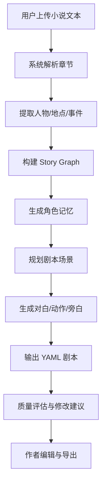

# 用户使用流程

## 1. 总体流程

## 2. 演示界面功能说明

> 演示界面基于 Gradio 实现，聚焦核心转换流程的可交互展示，不是完整前端产品。

| 模块 | 功能 |
|---|---|
| 输入区 | 粘贴或上传 txt / md 小说文件，点击开始转换 |
| 解析结果区 | 展示识别的人物、地点、事件列表 |
| 剧本输出区 | 展示生成的 YAML 剧本内容，支持复制下载 |
| 质量评估区 | 展示各维度评分和修改建议 |
