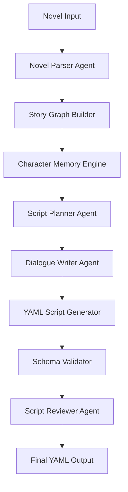

# 系统架构设计

## 1. 总体架构



## 2. 架构分层

| 层级 | 模块 |
|---|---|
| 输入层 | 小说上传、章节识别、文本预处理 |
| 理解层 | 人物提取、事件抽取、地点识别、情绪识别 |
| 记忆层 | Story Graph、Character Memory、Source Trace |
| 生成层 | 场景规划、对白生成、动作生成、旁白生成 |
| 校验层 | YAML 校验、Schema 校验、字段完整性检查 |
| 评估层 | 剧情连贯性、人物一致性、对白自然度、转场合理性 |
| 输出层 | YAML、Markdown、分镜表、质量报告 |

## 3. 推荐技术栈

| 模块 | 技术 |
|---|---|
| 前端 | Gradio（演示界面） |
| 后端 | Python FastAPI |
| LLM 调用 | OpenAI API / 本地大模型 |
| 向量库 | FAISS（Demo 阶段） |
| 图数据 | NetworkX（Demo 阶段） |
| YAML 处理 | PyYAML |
| Schema 校验 | Pydantic / JSON Schema |
| Demo 部署 | Docker |
| 文档 | Markdown + Mermaid |

## 4. 数据流

```text
novel.md
  ↓
chapter_blocks
  ↓
entity_event_extraction
  ↓
story_graph.json
  ↓
character_memory.json
  ↓
script_plan.json
  ↓
screenplay_output.yaml
  ↓
quality_report.yaml
```
