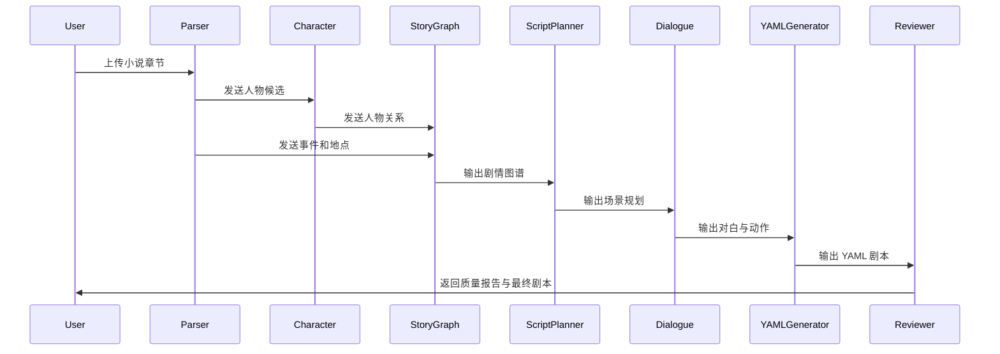

# Multi-Agent 多智能体设计

## 1. 设计目标

小说改编剧本不是单一步骤，而是包含理解、规划、创作、审查等多个阶段。为了降低单个模型直接生成时的混乱和遗漏，系统采用多智能体协同工作。

## 2. Agent 列表

| Agent | 职责 |
|---|---|
| Novel Parser Agent | 解析小说章节、段落、对话和叙事 |
| Character Agent | 建立人物画像和人物关系 |
| Story Graph Agent | 构建人物、事件、地点之间的剧情图谱 |
| Script Planner Agent | 将章节事件重组为剧本场景 |
| Dialogue Writer Agent | 生成自然对白 |
| Camera Agent | 生成镜头和分镜建议 |
| YAML Generator Agent | 输出合法 YAML |
| Reviewer Agent | 检查剧本质量并给出修改建议 |

## 3. Agent 协作流程

## 4. Prompt 设计原则

### Novel Parser Agent

要求：

1. 不改写原文；
2. 只抽取结构化信息；
3. 标记章节和段落来源；
4. 保留不确定信息。

### Script Planner Agent

要求：

1. 不按章节机械拆分；
2. 以场景为单位重组；
3. 保证每个场景有明确戏剧目的；
4. 保留关键冲突。

### Dialogue Writer Agent

要求：

1. 避免说明性台词过多；
2. 保持人物语言风格一致；
3. 将心理描写转为动作或潜台词；
4. 不删除关键剧情信息。

### Reviewer Agent

要求：

1. 检查人物设定是否矛盾；
2. 检查场景转场是否突兀；
3. 检查 YAML 字段是否完整；
4. 输出可执行修改建议。
