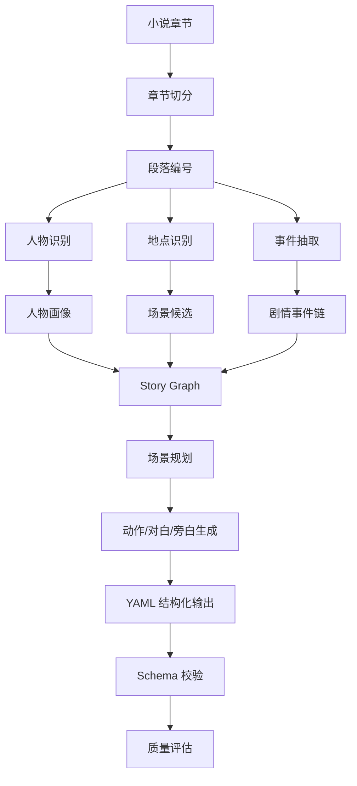

# 小说转剧本流程设计

## 1. 转换难点

小说和剧本的表达方式不同：

| 小说 | 剧本 |
|---|---|
| 章节组织 | 场景组织 |
| 大量心理描写 | 动作、表情、潜台词 |
| 叙述推进 | 冲突推进 |
| 作者视角 | 角色行为与对白 |
| 语言描写 | 可拍摄画面 |

因此系统不能简单总结小说，而要进行剧本化改编。

## 2. 转换流程

## 3. 场景规划规则

每个场景必须包含：

1. 地点；
2. 时间；
3. 出场人物；
4. 戏剧目的；
5. 冲突等级；
6. 情绪变化；
7. 动作/对白/旁白 beat；
8. 来源章节。

## 4. 心理描写转写规则

小说心理描写不能全部转成旁白，应优先转换为：

| 小说内容 | 剧本化方式 |
|---|---|
| 心里一惊 | 停顿、眼神变化 |
| 想起往事 | 闪回或旁白 |
| 暗自怀疑 | 试探性对白 |
| 内心痛苦 | 表情、动作、沉默 |
| 大段背景解释 | 场景信息或短旁白 |

## 5. 对白生成规则

对白需要：

1. 服务冲突；
2. 符合人物身份；
3. 避免过度解释；
4. 保留潜台词；
5. 与动作配合。

## 6. 输出后处理

输出 YAML 后进行：

1. YAML 语法检查；
2. 必填字段检查；
3. ID 唯一性检查；
4. 人物引用检查；
5. 来源追踪检查；
6. 质量评分。
