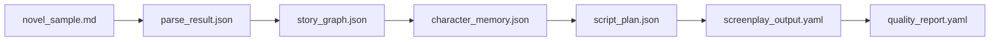

# API 与数据流设计

## 1. API 概览

| 接口 | 方法 | 功能 |
|---|---|---|
| /api/novel/upload | POST | 上传小说 |
| /api/novel/parse | POST | 解析章节 |
| /api/story-graph/build | POST | 构建剧情图谱 |
| /api/script/generate | POST | 生成剧本 |
| /api/script/validate | POST | 校验 YAML |
| /api/script/review | POST | 质量评估 |
| /api/export/yaml | GET | 导出 YAML |

## 2. 数据流



## 3. 生成剧本接口示例

请求：

```json
{
  "novel_id": "novel_001",
  "output_format": "screenplay",
  "schema_version": "1.0",
  "options": {
    "enable_camera": true,
    "enable_source_trace": true,
    "enable_quality_review": true
  }
}
```

响应：

```json
{
  "script_id": "script_001",
  "yaml_url": "/exports/screenplay_output.yaml",
  "quality_score": 88,
  "status": "success"
}
```
